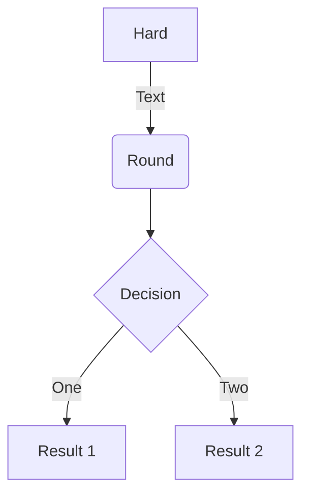
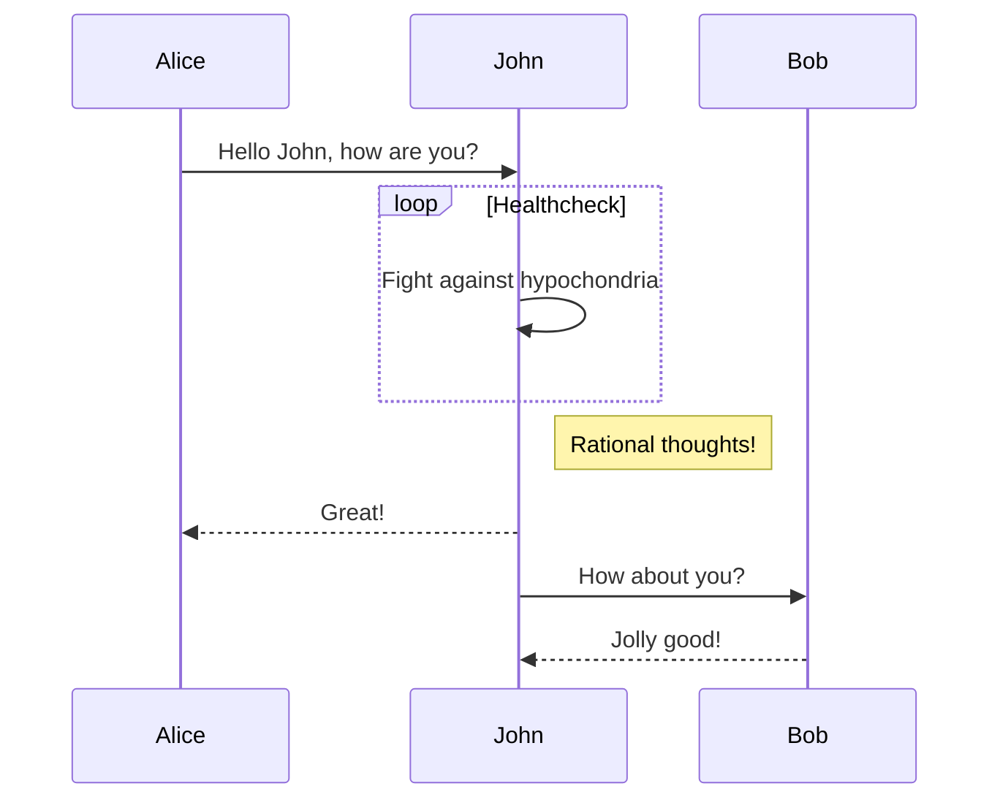
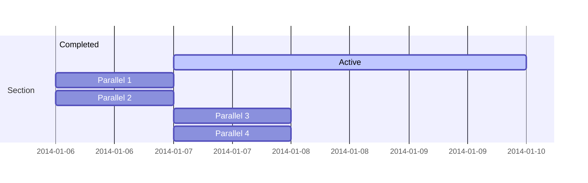
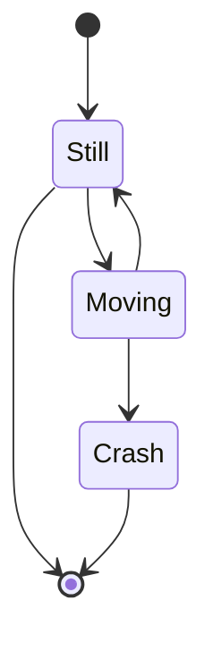
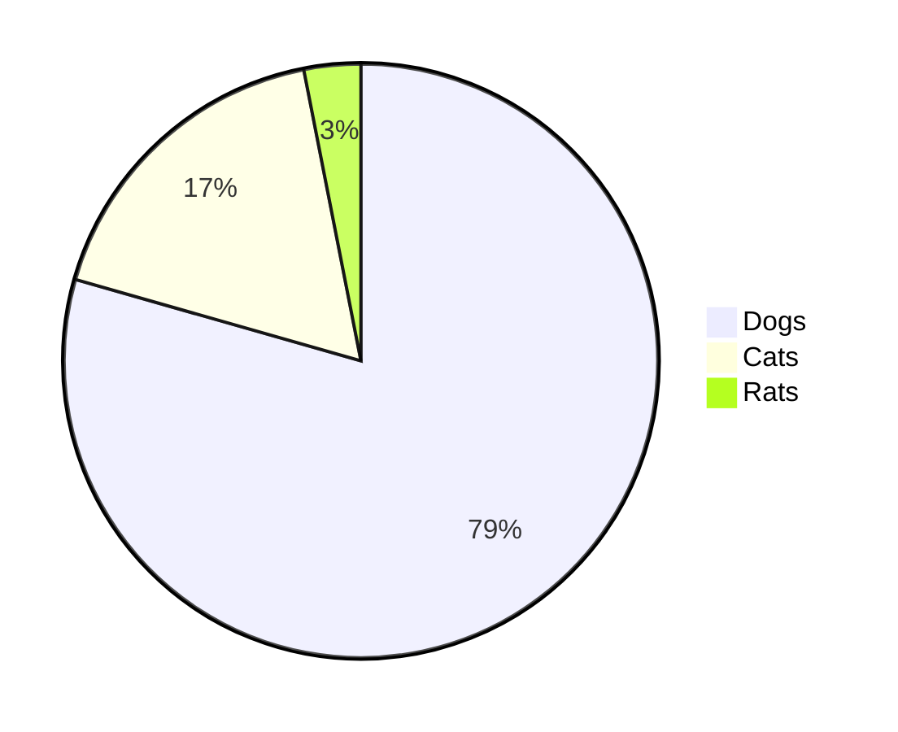

# Markdown Syntax Guide


&emsp;&emsp;本文主要介绍了Markdown语法的基本语法，从而使**Markdowners**专注于内容和技术，不再担心排版问题。注意，以下介绍是通用语法，可能在其它平台，诸如在Hexo、Hugo等静态博客下的主题中，语法略显不同，注意区别。
<!--more-->

### 简介

> &emsp;&emsp;Markdown是为网络书写者而生的方便“text-to-HTML”工具，它允许人们用一种易读易写的纯文本格式进行书写，然后将其转化成XHTML（或HTML）。
>
> &emsp;&emsp;Markdown 的特点是“易读易写”，其中**可读性**是最重要的。一份使用 Markdown 格式撰写的文件应该可以直接以纯文本发布，并且看起来不会像是由许多标签或是格式指令所构成。
>
> &emsp;&emsp;Markdown 语法的目标是：成为一种适用于网络的书写语言。
>
> &emsp;&emsp;Markdown 不是想要取代 HTML，甚至也没有要和它相近，它的语法种类很少，只对应 HTML 标记的一小部分。Markdown 的构想不是要使得 HTML 文档更容易书写。在我看来， HTML 已经很容易写了。Markdown 的理念是，能让文档更容易读、写和随意改。HTML 是一种发布的格式，Markdown 是一种书写的格式。就这样，Markdown 的格式语法只涵盖纯文本可以涵盖的范围。
>
> &emsp;&emsp;&emsp;&emsp;&emsp;&emsp;&emsp;&emsp;&emsp;&emsp;&emsp;&emsp;&emsp;&emsp;&emsp;&emsp;&emsp;&emsp;&emsp;&emsp;&emsp;&emsp;&emsp;&emsp;&emsp;&emsp;&emsp;&emsp;&emsp;&emsp;&emsp;&emsp;&emsp;&emsp;&emsp;&emsp;—— John Gruber

&emsp;&emsp;**Markdown**是一种[轻量级标记语言](https://zh.wikipedia.org/wiki/轻量级标记语言)，创始人为[约翰·格鲁伯](https://zh.wikipedia.org/wiki/約翰·格魯伯)（英语：John Gruber）。它允许人们使用易读易写的纯文本格式编写文档，然后转换成有效的[XHTML](https://zh.wikipedia.org/wiki/XHTML)（或者[HTML](https://zh.wikipedia.org/wiki/HTML)）文档，因此有些HTML语法也可以直接在Markdown中应用。

&emsp;&emsp;由于**Markdown**的轻量化、易读易写特性，并且对于图片，图表、数学式都有支持，目前许多网站都广泛使用Markdown来撰写帮助文档或是用于[论坛](https://zh.wikipedia.org/wiki/网络论坛)上发表消息。如[GitHub](https://zh.wikipedia.org/wiki/GitHub)、[Reddit](https://zh.wikipedia.org/wiki/Reddit)、[Diaspora](https://zh.wikipedia.org/wiki/Diaspora)、[Stack Exchange](https://zh.wikipedia.org/wiki/Stack_Exchange)、[OpenStreetMap](https://zh.wikipedia.org/wiki/OpenStreetMap) 、[SourceForge](https://zh.wikipedia.org/wiki/SourceForge)、[Gitbook](https://gitbook.com)、[GitLab](https://gitlab.com)、[Gitee](https://gitee.com)、[简书](https://zh.wikipedia.org/wiki/简书)、[掘金](https://juejin.im)、[CSDN](https://blog.csdn.net/)等，甚至还能被使用来撰写[电子书](https://zh.wikipedia.org/wiki/電子書)。

&emsp;&emsp;**Markdown**具有一系列衍生版本，用于扩展Markdown的功能（如表格、脚注、内嵌HTML等等），这些功能原初的Markdown尚不具备，它们能让Markdown转换成更多的格式，例如LaTeX，Docbook。

&emsp;&emsp;**Markdown**增强版中比较有名的有Markdown Extra、MultiMarkdown、 Maruku等。这些衍生版本要么基于工具，如Pandoc；要么基于网站，如GitHub和Wikipedia，在语法上基本兼容，但在一些语法和渲染效果上有改动。

&emsp;&emsp;总结一下Markdown的[特点](https://sspai.com/post/37263)：

- Markdown是一种**轻量级**的标记语言；

- Markdown的特点是**易读易写**；

- Markdown的**内容与形式相分离**；

- Markdown文档书写方式是**源码**书写，基本纯键盘输入；

- Markdown文档是纯文本文档，意味着图片独立于文档之外；

- Markdown是**书写语言**，不是发布语言，发布需要转换成Html；


<table><tr><td bgcolor=#54FF9F> 以下内容为<font color="red">Markdown</font>的<font color="blue" size = 5 face="华文楷体"> 基本语法</font>，结合各种<b>官方文档</b>和本人的<font color="#9B30F"><b>使用经验</b></font>使用经验而成。 </td></tr></table>

<font size = 2 face="宋体"> 注：以下代码均在Typora中测试通过。</font>

### 标题

**语法：** <kbd>#</kbd>的个数 + <kbd>space</kbd> + 文本

**解释：** 

- 直接输入1次<kbd>#</kbd>，并按下<kbd>space</kbd>后，再输入文本内容，将生成1级标题；

- 输入2次<kbd>#</kbd>，并按下<kbd>space</kbd>后，再输入文本内容，将生成2级标题；

  以此类推，输入几个<kbd>#</kbd>，就生成几级标题，大部分Markdown最多支持**6级标题**。

**示例：**

格式：

`# 一级标题`

`## 二级标题`

`### 三级标题`

`#### 四级标题`

`##### 五级标题`

`###### 六级标题`

输出：

# 一级标题

## 二级标题

### 三级标题

#### 四级标题

##### 五级标题

###### 六级标题

---

### 文本样式

#### 强调/斜体

前后各一个`*`（星号）或各一个`_`（下划线符）包围的文本是倾斜文本。

`*强调文本* ` &emsp; *强调文本* 

`_强调文本_` &emsp; _强调文本_

#### 加粗

前后各两个`*`（星号）或各两个`_`（下划线符）包围的文本是加粗文本。

`**加粗文本**` &emsp; **加粗文本**

`__加粗文本__` &emsp; __加粗文本__

HTML方法

`<b>加粗文本</b>` &emsp; <b>加粗文本</b>

`<strong>加粗文本</strong>` &emsp; <strong>加粗文本</strong>

Note：`__`由两个`_`组成。

#### 强调并加粗

`***强调并加粗***` &emsp; ***强调并加粗***

`**_强调并加粗_**` &emsp; **_强调并加粗_**

#### 删除线

`~~删除文本~~ `&emsp; ~~删除文本~~

#### 标记/高亮

`==标记文本==` 

`<mark>标记文本</mark>` 

**Note**： Github貌似不支持渲染该功能；

#### 下划线

`<u>下划线</u>`

**Note**： Github貌似不支持渲染该功能；

#### 引用

**单次引用**

`> 引用文本`

> 引用文本

**嵌套引用**

```
> 嵌套引用1
>> 嵌套引用2
>>> 嵌套引用3
>>
>> 嵌套引用2
>
> 嵌套引用1
```

   > 嵌套引用1
   >> 嵌套引用2
   >>> 嵌套引用3
   >>
   >> 嵌套引用2
   >
   > 嵌套引用1	

**Note**：

1. 在对文本进行操作时，**注意在这些符号的两侧空一格**，以免编译错误，尤其在中文编辑时。
2. 引用可以和列表相互调用。

---

### 列表

&emsp;&emsp;Markdown列表有**有序列表**、**无序列表**、**任务列表**、**自定义列表**四种。**列表可以嵌套成多级列表**。

- **有序列表**

  **`数字`+<kbd>.</kbd>+`空格`+`文本`**

  格式：

  `1. 文本一`

  `2. 文本二`

  `3. 文本三`

  输出：

  1. 文本一

  2. 文本二

  3. 文本三

- **无序列表**

  `+`、`-`、`*`都可以用来标记无序列表。

  格式：**`-/+/*`+`空格`+`文本`**

  `- 文本一`

  `+ 文本二`

  `* 文本三`
  
  输出：

  - 文本一

  - 文本二

  - 文本三

    

- **任务列表**

  格式：**`-`+`空格`+<kbd>[</kbd>+`x(可选)`+<kbd>]</kbd>+`空格`+`文本`**

  `- [x] 已完成任务`

  `- [ ] 未完成任务`

  `- [ ] 未完成任务`

  输出：

  - [x] 已完成任务

  - [ ] 未完成任务

  - [ ] 未完成任务
  
    
  
- **嵌套列表**

  列表嵌套只需在子列表中的选项缩进四个空格即可，在Typora中，向右缩进的快捷键是<kbd>ctrl</kbd>+<kbd>]</kbd>。

  格式：

  ```
  1. 任务一：
      - 任务一嵌套的第一个元素
      - 任务一嵌套的第二个元素
  2. 任务二：
      - 任务二嵌套的第一个元素
      - 任务二嵌套的第二个元素
  ```

  输出：

  1. 任务一：
      - 任务一嵌套的第一个元素
      
      - 任务一嵌套的第二个元素
      
  2. 任务二：
      - 任务二嵌套的第一个元素
      
      - 任务二嵌套的第二个元素
      
        

---

### 插入链接＆图片&GIF

&emsp;&emsp;在Markdown里插入链接、图片和GIF，最常用的方法如下：

#### 链接

格式：`［显示文本］(链接地址URL)`

Typora快捷键：<kbd>ctrl</kbd>+<kbd>k</kbd>

举例：请点击这个[链接](htttps://www.baidu.com)进行搜索。

上述中的**链接**格式具体为：`[链接](https://www.baidu.com)`

#### 自动链接/邮箱

&emsp;&emsp;自动链接直接用一对**尖括号**包围即可。

`<https://www.kangzhiheng.top>`，显示<https://www.kangzhiheng.top>

&emsp;&emsp;电子邮件地址也可以被自动索引。

`<kangzhiheng@live.cn>`，显示<kangzhiheng@live.cn>

点击生成的链接会自动打开计算机上安装的电子邮件客户端程序。

#### 图片

Makrdown里的图片链接格式有两种：**默认格式**和**HTML方法**。

- **默认格式**：``

  注意：`[]`里面的注释可有可无，建议最好加上这个图片的注释；`()`里的图片链接可以是**本地图片链接**，也可以是**URL**。关于这个图片的链接URL方法，具体参考我的另一篇博文[《自建图床三驾马车：Typora、Gitee与PicGo》](https://kangzhiheng.top/post/12-imagehost-gitee-picgo/)。

  举例：``

  

  上述图片链接方法，默认是图片URL的**原始大小**，且**默认靠左显示**。如果使图片的大小可变且居中，可使用下面的HTML方法。

- **HTML方法**：`<div align=center>  </div>`

  其中：

  - `align`可选参数为：`left`、`center`、`right`；

    

  - `width`、`height`根据实际情况填写，可以是实际数字，也可以是百分比缩放。

    

  - `src`为图片URL。

  举例1：调整图片宽度为650，高度为150；

  `<div align=center>  </div>`

  <div align=center>  </div>

  举例2：调整图片宽度为原来的30%，高度为原来的40%；

  `<div align=center>  </div>`

  <div align=center>  </div>

---

### 代码

&emsp;&emsp;在Markdown中，代码分为两种：**行内代码**和**代码块**。

#### 行内代码/代码片段

格式：<kbb>\`</kbd> 代码片段 <kbb>\`</kbd>

输出：`代码片段`

#### 代码块

格式：

<pre>
```代码语言
   代码块
```
</pre>

举例：

Python语言：

<pre>
```python
#!/usr/bin/env python3
import tensorflow as tf

print(tf.__version__)
</pre>


输出：
```python
#!/usr/bin/env python3
import tensorflow as tf

print(tf.__version__)
```

---

### 段落

&emsp;&emsp;如果是中文书写习惯，每一段的开头，都应该空4个英文字符的宽度。一般在word里，在段首可以直接按<kbd>Tab</kbd>键实现，但在Markdown中，这并不起作用。这时需要用到HTML里的空格方法。

#### 缩进

`&emsp;`：全方大的空白，一个汉字（两个英文字符）的宽度，`&#8195;`于此同义；

`&ensp;`：半放大的空白，一个英文字符的宽度（½个汉字），`&#8194;`于此同义；

`&nbsp;`：不断行的空白，⅓个汉字的宽度，`&#160;`于此同义；

```html
顶格；

&emsp;空一个汉字的宽度；

&ensp;空½个汉字的宽度；

&nbsp;空⅓个汉字的宽度；
```

顶格；

&emsp;空一个汉字的宽度；

&ensp;空½个汉字的宽度；

&nbsp;空⅓个汉字的宽度；

**总结**：所以按照中文书写习惯，段首空两格，只需要在段首前面加`&emsp;&emsp;`就好；

#### 居中

Markdown本身没有居中的语法，需要HTML元素支持。

**格式1**：`<center>  人间有味是清欢  </center>`

**Note**： Github不支持渲染该功能；具体效果请参阅我的博客文章[《Markdown Syntax Guide》](https://kangzhiheng.top/post/13-markdown-syntax-guide/#%E6%AE%B5%E8%90%BD)。

**格式2：** `<p align="center"> 入淮清洛渐漫漫 </p>`

**输出：**

<p align="center"> 入淮清洛渐漫漫 </p>

**格式3：** `<div align=center> 一蓑烟雨任平生 </div>`

**输出：**

<div align=center> 一蓑烟雨任平生 </div>

#### 换行

在Makrdown源代码模式下，有两种换行方法：

1. 在段末连续**两次**按下<kbd>Enter</kbd>，即两个段落之间空一行；

2. 在上一段的末尾加上HTML标签`<br>`即可换行；

**注意**：在Typora中，直接在段末按下<kbd>Enter</kbd>即可换行；

#### 字体

格式：

```html
<font face="华文行楷">华文行楷</font>  
<center><font face="华文行楷">华文行楷居中</font></center> 
<font face="黑体">我是黑体字</font>
<font face="宋体">我是宋体字</font>
<font face="微软雅黑">我是微软雅黑字</font>
<font face="fantasy">我是fantasy字</font>
<font face="Helvetica">我是Helvetica字</font>
<font face="STCAIYUN">我是华文彩云</font>	
```

**Note**： Github不支持渲染该功能；具体效果请参阅我的博客文章[《Markdown Syntax Guide》](https://kangzhiheng.top/post/13-markdown-syntax-guide/#%E6%AE%B5%E8%90%BD)。

#### 字号

格式：

```html
<font Size=1>我是1号字</font>  
<font Size=2>我是2号字</font>  
<font Size=3>我是3号字</font>  
<font Size=4>我是4号字</font>  
<font Size=5>我是5号字</font>  
<font Size=6>我是6号字</font>  
<font Size=7>我是7号字</font>
```

**注意**：**这里的字号与word里的不同，浏览器一般默认字号为<font color=red>3号</font>。**

#### 颜色

查看颜色表： http://www.114la.com/other/rgb.htm，选择需要的颜色所对应的RGB值（十六进制）。

格式：

```html
<font color="red"> 我是红色字体，color=red </font>  
<font color="yellow"> 我是黄色字体，color=yellow </font>   
<font color="blue"> 我是蓝色字体，color=blue </font>  
<font color="green"> 我是绿色字体，color=green </font>  
<font color="gray"> 我是灰色字体，color=gray </font>  
<font color="orange"> 我是橙色字体，color=orange </font>  
<font color="brown"> 我是棕色字体，color=brown </font> 

<font color="#FF8C69"> 字体颜色，color=#FF8C69 </font>  
<font color="#EE82EE"> 字体颜色，color=#EE82EE </font>  
<font color="#C1FFC1"> 字体颜色，color=#C1FFC1 </font>  
<font color="#9B30FF"> 字体颜色，color=#9B30FF </font>  
<font color="#CD00CD"> 字体颜色，color=#CD00CD </font>  
<font color="#00B2EE"> 字体颜色，color=#00B2EE </font> 
```

输出：


**Note**： Github不支持渲染该功能；具体效果请参阅我的博客文章[《Markdown Syntax Guide》](https://kangzhiheng.top/post/13-markdown-syntax-guide/#%E6%AE%B5%E8%90%BD)。

#### 同时改变字体、字号和颜色

在HTML元素<mark>\<font></font\></mark>中可选的属性有字体`face`、字号`size`和颜色`color`，可以自由组合，**属性之间没有逗号**。

举例：

`<font face="华文行楷" size=5 color=#CD00CD > 大小为5号，颜色为#CD00CD的华文行楷。 </font> `

**Note**： Github不支持渲染该功能；具体效果请参阅我的博客文章[《Markdown Syntax Guide》](https://kangzhiheng.top/post/13-markdown-syntax-guide/#%E6%AE%B5%E8%90%BD)。

#### 背景色

查看颜色表： http://www.114la.com/other/rgb.htm，选择需要的颜色所对应的RGB值（十六进制）。

格式：

```html
<table><tr><td bgcolor=#FF69B4> 背景色由十六进制颜色值设置而成：#FF69B4 </td></tr></table>
<table><tr><td bgcolor=#FF83FA> 背景色由十六进制颜色值设置而成：#FF83FA </td></tr></table>
<table><tr><td bgcolor=#40E0D0> 背景色由十六进制颜色值设置而成：#40E0D0 </td></tr></table>
<table><tr><td bgcolor=#C0FF3E> 背景色由十六进制颜色值设置而成：#C0FF3E </td></tr></table>
<table><tr><td bgcolor=#54FF9F> 背景色由十六进制颜色值设置而成：#54FF9F </td></tr></table>
```

输出：


**Note**： Github不支持渲染该功能；具体效果请参阅我的博客文章[《Markdown Syntax Guide》](https://kangzhiheng.top/post/13-markdown-syntax-guide/#%E6%AE%B5%E8%90%BD)。

#### 分割线/水平线

&emsp;&emsp;在标准 Markdown 中，分割线/水平线一般由连续的**3个**同样的<kbd>-</kbd>、<kbd>+</kbd>、<kbd>*</kbd>组成，只需这三个符号在同一行且没有字符（除了空格）即可，符号之间有没有空格不影响分割线的生成。如`-- -`、`+  +      +`、`***`都可以。

分割线的效果见每一小节之间，如下。

---

### 表格

#### 基本表格

基本的表格方法如下：

```bash
| Items | Prices|
| :--: | : -- : |
| Apple | 20$ |
| Banana | 25$ |
```

详细介绍：

- 第一行：**表头**，两个符号<kbd>|</kbd>间的内容是标题；

- 第二行：**可选**，**设置表中内容的对齐方式**，默认是靠近显示，如下：

  `: --- :`设置内容**水平居中对齐**；

  `: --- `设置内容**左对齐**；

  ` --- :`设置内容**右对齐**；

  **注意**：
  
  - 对齐方式依次用<kbd>|</kbd>进行间隔；
  
    
  
  - `:`是**英文**下的冒号，且旁边的`-`的个数不限制；
  
    
  
  - **标题的对齐方式**，与编辑器有关，有些编辑器里的标题对齐方式与内容一致，而有一些编辑器相反，这时如果想要使标题居中对齐，则需要HTML标签`<center></center>`。
  
- 下面几行，是表格的内容，也依次用<kbd>|</kbd>间隔，表格的内容与表头一一对应；

如下：

```bash
| <center> Items </center> | <center> Processor </center> | <center> Display </center> | <center> B/C </center> | <center> Camera </center>  | <center> S/R </center> |<center> Prices（RMB） </center> |
| :---: | :---: | :---: | :---: | :---: | :---: | :---: |
| HuaWei P40 Pro | HUAWEI Kirin 990 5G | 6.58"OLED / 2K / 90Hz | 4200mAh / 40W | 5000 / 3200 | 8G + 128G / 256G / 512G | 5988 /6498 / 7388 |
| OPPO Find X2 Pro | Qualcomm® Snapdragon™ 865 | 6.67"AMOLED / 3K QHD+/ 120Hz | 2*2130mAh / 65W | 4800 / 3200 | 12G + 256G | 6999 |
| OnePlus 8 Pro | Qualcomm® Snapdragon™ 865 | 6.78"AMOLED / 2K / 120Hz | 4510mAh / Warp Charge 30T Fast Charging (5V/6A) | 4800 / 1600 | 8G + 128G / 12G + 256G | 5399 / 5999 |
| Xiaomi 10 Pro | Qualcomm® Snapdragon™ 865 | 6.67"AMOLED / 90Hz | 4500mAh / 50W | 10000 / 2000 | 8G + 256G / 12G + 256G / 12G + 512G | 4999 / 5499 / 5999 |
| Vivo NEX 3 |  Qualcomm® Snapdragon™ 865 Plus | 6.89''POLED /  2K FHD+ | 4500mAh /  22.5W | 6400 / 1600 | 8G + 256G | 4998 |
```

显示：

| <center> Items </center> | <center> Processor </center> | <center> Display </center> | <center> B/C </center> | <center> Camera </center>  | <center> S/R </center> |<center> Prices（RMB） </center> |
| :---: | :---: | :---: | :---: | :---: | :---: | :---: |
| HuaWei P40 Pro | HUAWEI Kirin 990 5G | 6.58"OLED / 2K / 90Hz | 4200mAh / 40W | 5000 / 3200 | 8G + 128G / 256G / 512G | 5988 /6498 / 7388 |
| OPPO Find X2 Pro | Qualcomm® Snapdragon™ 865 | 6.67"AMOLED / 3K QHD+/ 120Hz | 2*2130mAh / 65W | 4800 / 3200 | 12G + 256G | 6999 |
| OnePlus 8 Pro | Qualcomm® Snapdragon™ 865 | 6.78"AMOLED / 2K / 120Hz | 4510mAh / Warp Charge 30T Fast Charging (5V/6A) | 4800 / 1600 | 8G + 128G / 12G + 256G | 5399 / 5999 |
| Xiaomi 10 Pro | Qualcomm® Snapdragon™ 865 | 6.67"AMOLED / 90Hz | 4500mAh / 50W | 10000 / 2000 | 8G + 256G / 12G + 256G / 12G + 512G | 4999 / 5499 / 5999 |
| Vivo NEX 3 |  Qualcomm® Snapdragon™ 865 Plus | 6.89''POLED /  2K FHD+ | 4500mAh /  22.5W | 6400 / 1600 | 8G + 256G | 4998 |

<font face="宋体" size=2 > 注：以上数据于2020年5月30号来源于各大官网。B/C表示Battery and Charge，S/R表示Storage and RAM。</font>

#### 合并单元格

- `<br>`**方法**

  合并单元格，也即单元格内换行，使用`<br>`即可，其它设置与普通表格一致。

  ```bash
  | <center> 姓名 </center> | <center> 爱好 </center>  |
  | :--: | :-----------------------: |
  | 张三 |      足球 <br> 篮球       |
  | 李四 |  羽毛球 <br> 乒乓球HTML方法 |
  ```

  **显示：**

  | <center> 姓名 </center> | <center> 爱好 </center> |
  | :--: | :-----------------------: |
  | 张三 |      足球 <br> 篮球       |
  | 李四 | 羽毛球 <br>乒乓球HTML方法 |

- **HTML方法**

  ```bash
  <table>
  	<tr>
  	    <th>属性</th>
  	    <th>属性值</th>
  	    <th>描述</th>  
  	</tr >
  	<tr >
  	    <td rowspan="3">type </td>
  	    <td>text</td>
  	    <td>单行文本输入框</td>
  	</tr>
  	<tr>
  	    <td>password</td>
  	    <td>密码输入框</td>
  	</tr>
  	<tr>
  	    <td>radio</td>
  	    <td>单选按钮</td>
  	</tr>
  	<tr>
  	    <td  rowspan="2">name</td>
  	    <td>用户自定义</td>
  	    <td>控件名称</td>
  	</tr>
  	<tr>
  		<td> 用户自定义 </td>
  		<td> 控件名称 </td>
  	</tr>
  	<tr>
  	    <td >value</td>
  	    <td >用户自定义</td>
  	    <td >默认文本值</td>
  	</tr>
  </table>
  ```

  **显示：**

  <table>
  	<tr>
  	    <th>属性</th>
  	    <th>属性值</th>
  	    <th>描述</th>  
  	</tr >
  	<tr >
  	    <td rowspan="3">type </td>
  	    <td>text</td>
  	    <td>单行文本输入框</td>
  	</tr>
  	<tr>
  	    <td>password</td>
  	    <td>密码输入框</td>
  	</tr>
  	<tr>
  	    <td>radio</td>
  	    <td>单选按钮</td>
  	</tr>
  	<tr>
  	    <td  rowspan="2">name</td>
  	    <td>用户自定义</td>
  	    <td>控件名称</td>
  	</tr>
  	<tr>
  		<td> 用户自定义 </td>
  		<td> 控件名称 </td>
  	</tr>
  	<tr>
  	    <td >value</td>
  	    <td >用户自定义</td>
  	    <td >默认文本值</td>
  	</tr>
  </table>


---

### 脚注

Markdown的脚注功能有两种实现方法。

#### 方法一

```bash
脚注[^1]
[^1]: 这里是脚注
```

#### 方法二

如果希望被注释的文本是*斜体*，则追加`<cite></cite>`即可，如下：

```bash
<cite>脚注[^1]</cite>
[^1]: 这里是脚注
```

**脚注的部分会在文章的末尾进行显示，并且支持跳转到指定位置。**

---

### 锚点跳转

&emsp;&emsp;有这么一种情况：浏览一个很长的文章时，可能只对其中几个章节感兴趣时，需要直接跳转到该章节，这时就需要**锚点**。

&emsp;&emsp;**锚点**是是网页制作中超级链接的一种，又叫**命名锚记**。使用命名锚记可以在文档中设置标记，这些标记通常放在文档的特定主题处或顶部。然后可以创建到这些命名锚记的链接，这些链接可快速将访问者带到指定位置。

&emsp;&emsp;**锚点跳转**要注意首先要注意以下两点：

1. 锚点的标识名称，可使用任意字符，使用锚点跳转；

2. 锚点生成的链接，可以是页内跳转，也可以生成目录；

3. 锚点**只对**<kbd>#</kbd>标注的标题生成锚点链接；
4. 锚点的基本格式是：`[跳转标题](#跳转标题)`，注意`()`里的<kbd>#</kbd>与后面的内容**无空格**，且只有一个<kbd>#</kbd>，该符号与正文里的多级标题无关（不管是几级标题，只需要一个<kbd>#URL</kbd>）；
5. **非英文的锚点字符**，在单击跳转时，在浏览器的URL中会按照规则进行**编码**和**解码**；

在使用时还需要记住以下几个问题：

- 任意 1-6 个<kbd>#</kbd>标注的标题都可设置为同名的锚点链接

  ```bash
  [标题1](#标题1)  
  [标题2](#标题2)  
  [标题3](#标题3)  
  
  # 标题1 
  ## 标题2 
  ### 标题3
  ```

- **大写字母要转换成小写**

  ```bash
  [Github标题](#github标题)
  
  ### Github标题
  ```

- 多单词锚点的**空格**用<kbd>-</kbd>代替

  ```bash
  [Github Heading](#github-heading)
  
  ### Github Heading
  ```

- 多级序号需要去除<kbd>.</kbd>

  ```bash
  [2.3. Github Heading](#23-github-heading)
  
  ### 2.3. Github Heading
  ```

---

### MathJax公式

&emsp;&emsp;[MathJax](https://www.mathjax.org/)和[Katex](https://katex.org/)是两种支持HTML的轻量级的数学公式引擎，但`MathJax`对**行内公式**支持较好。它们的低层都是TEX，所以$\LaTeX$的语法，都可以在<kbd>$</kbd>和<kbd>$</kbd><kbd>$</kbd>中被渲染。在hugo中配置MathJax请参阅[文章](https://xuchengpeng.com/hugo-blog/2018/05/25/mathjax-in-markdown-blog/)。

#### 行内公式

&emsp;&emsp;使用一对<kbd>$</kbd>来区别正常文字和行内公式。如```$ x=\frac{-b\pm\sqrt{b^2-4ac}}{2a} $```，效果为$ x=\frac{-b\pm\sqrt{b^2-4ac}}{2a} $

#### 块状公式
&emsp;&emsp;块状公式由一对<kbd>$</kbd><kbd>$</kbd>进行区别，如下，欧拉积分表示为
```bash
$$
\Gamma(z) = \int_0^\infty t^{z-1}e^{-t}dt\,.
$$
```

$$
\Gamma(z) = \int_0^\infty t^{z-1}e^{-t}dt\,.
$$

&emsp;&emsp;**在hugo中使用MathJax需要注意的问题：**

**多行公式**

&emsp;&emsp;如下图，多行公式
$$
\begin{aligned}
   a=& b+c-d \cr
   &+e-f \cr
   =& g+h \cr
   =& i
   \end{aligned}
$$
&emsp;&emsp;正常的$\LaTeX$语法是
   ```bash
   $$
   \begin{aligned}
   a=& b+c-d \
   &+e-f \
   =& g+h \
   =& i
   \end{aligned}
   $$
   ```
&emsp;&emsp;可是却显示为一行，如下
$$
   \begin{aligned}
   a=& b+c-d \
   &+e-f \
   =& g+h \
   =& i
   \end{aligned}
$$
&emsp;&emsp;这是因为hugo的Markdwon渲染器是blackfriday，字符转义存在一些问题，解决方法是在每一行公式后的<kbd>\\</kbd>，加<kbd>cr</kbd>，如下：
   ```bash
   $$
   \begin{aligned}
   a=& b+c-d \cr
   &+e-f \cr
   =& g+h \cr
   =& i
   \end{aligned}
   $$
   ```
&emsp;&emsp;$\LaTeX$中的[特殊符号](https://drivingc.com/p/5b1bd56d2392ec23b91bab2e)，请参阅[链接](http://estudijas.lu.lv/pluginfile.php/14809/mod_page/content/16/instrukcijas/matematika_moodle/LaTeX_Symbols.pdf)。

---

### Mermaid库

&emsp;&emsp;[Mermaid](https://mermaid-js.github.io/mermaid) 是一个用于画流程图、状态图、时序图、甘特图的库，使用 JS 进行本地渲染，广泛集成于许多 Markdown 编辑器中，可以尝试[在线Mermaid编辑器](https://mermaid-js.github.io/mermaid-live-editor/)（<font color="red" > 推荐 </font>）。

<table>
<!-- <Flowchart> -->
<tr><td colspan=2 align="center">
    <b>Flow</b></br>
    [<a href="http://mermaid-js.github.io/mermaid/#/flowchart">docs</a> - <a href="https://mermaidjs.github.io/mermaid-live-editor/#/edit/eyJjb2RlIjoiZ3JhcGggVERcbiAgICBBW0hhcmRdIC0tPnxUZXh0fCBCKFJvdW5kKVxuICAgIEIgLS0-IEN7RGVjaXNpb259XG4gICAgQyAtLT58T25lfCBEW1Jlc3VsdCAxXVxuICAgIEMgLS0-fFR3b3wgRVtSZXN1bHQgMl0iLCJtZXJtYWlkIjp7InRoZW1lIjoiZGVmYXVsdCJ9fQ">live editor</a>]
</td></tr>
<tr>
    <td><pre>

    </pre></td>
    <td align="center">
        
    </td>
</tr>
<!-- </Flowchart> -->
<!-- <Sequence> -->
<tr><td colspan=2 align="center">
    <b>Sequence</b><br />
    [<a href="http://mermaid-js.github.io/mermaid/#/sequenceDiagram">docs</a> - <a href="https://mermaidjs.github.io/mermaid-live-editor/#/edit/eyJjb2RlIjoic2VxdWVuY2VEaWFncmFtXG5BbGljZS0-PkpvaG46IEhlbGxvIEpvaG4sIGhvdyBhcmUgeW91P1xubG9vcCBIZWFsdGhjaGVja1xuICAgIEpvaG4tPj5Kb2huOiBGaWdodCBhZ2FpbnN0IGh5cG9jaG9uZHJpYVxuZW5kXG5Ob3RlIHJpZ2h0IG9mIEpvaG46IFJhdGlvbmFsIHRob3VnaHRzIVxuSm9obi0tPj5BbGljZTogR3JlYXQhXG5Kb2huLT4-Qm9iOiBIb3cgYWJvdXQgeW91P1xuQm9iLS0-PkpvaG46IEpvbGx5IGdvb2QhIiwibWVybWFpZCI6eyJ0aGVtZSI6ImRlZmF1bHQifX0">live editor</a>]
</td></tr>
<tr>
    <td><pre>

    </pre></td>
    <td align="center">
        
    </td>
</tr>
<!-- </Sequence> -->
<!-- <Gantt> -->
<tr><td colspan=2 align="center">
    <b>Gantt</b><br />
    [<a href="http://mermaid-js.github.io/mermaid/#/gantt">docs</a> - <a href="https://mermaidjs.github.io/mermaid-live-editor/#/edit/eyJjb2RlIjoiZ2FudHRcbnNlY3Rpb24gU2VjdGlvblxuQ29tcGxldGVkIDpkb25lLCAgICBkZXMxLCAyMDE0LTAxLTA2LDIwMTQtMDEtMDhcbkFjdGl2ZSAgICAgICAgOmFjdGl2ZSwgIGRlczIsIDIwMTQtMDEtMDcsIDNkXG5QYXJhbGxlbCAxICAgOiAgICAgICAgIGRlczMsIGFmdGVyIGRlczEsIDFkXG5QYXJhbGxlbCAyICAgOiAgICAgICAgIGRlczQsIGFmdGVyIGRlczEsIDFkXG5QYXJhbGxlbCAzICAgOiAgICAgICAgIGRlczUsIGFmdGVyIGRlczMsIDFkXG5QYXJhbGxlbCA0ICAgOiAgICAgICAgIGRlczYsIGFmdGVyIGRlczQsIDFkIiwibWVybWFpZCI6eyJ0aGVtZSI6ImRlZmF1bHQifX0">live editor</a>]
</td></tr>
<tr>
    <td><pre>

    </pre></td>
    <td align="center">
        
    </td>
</tr>
<!-- </Gantt> -->
<!-- <Class> -->
<tr><td colspan=2 align="center">
    <b>Class</b><br />
    [<a href="http://mermaid-js.github.io/mermaid/#/classDiagram">docs</a> - <a href="https://mermaidjs.github.io/mermaid-live-editor/#/edit/eyJjb2RlIjoiY2xhc3NEaWFncmFtXG5DbGFzczAxIDx8LS0gQXZlcnlMb25nQ2xhc3MgOiBDb29sXG48PGludGVyZmFjZT4-IENsYXNzMDFcbkNsYXNzMDkgLS0-IEMyIDogV2hlcmUgYW0gaT9cbkNsYXNzMDkgLS0qIEMzXG5DbGFzczA5IC0tfD4gQ2xhc3MwN1xuQ2xhc3MwNyA6IGVxdWFscygpXG5DbGFzczA3IDogT2JqZWN0W10gZWxlbWVudERhdGFcbkNsYXNzMDEgOiBzaXplKClcbkNsYXNzMDEgOiBpbnQgY2hpbXBcbkNsYXNzMDEgOiBpbnQgZ29yaWxsYVxuY2xhc3MgQ2xhc3MxMCB7XG4gID4-c2VydmljZT4-XG4gIGludCBpZFxuICBzaXplKClcbn0iLCJtZXJtYWlkIjp7InRoZW1lIjoiZGVmYXVsdCJ9fQ">live editor</a>]
</td></tr>
<tr>
    <td><pre>
```mermaid
classDiagram
Class01 &lt;|-- AveryLongClass : Cool
&lt;&lt;interface>> Class01
Class09 --> C2 : Where am i?
Class09 --* C3
Class09 --|> Class07
Class07 : equals()
Class07 : Object[] elementData
Class01 : size()
Class01 : int chimp
Class01 : int gorilla
class Class10 {
  &lt;&lt;service>>
  int id
  size()
}
```
</pre></td>
    <td align="center">
        
    </td>
</tr>
<!-- </Class> -->
<!-- <State> -->
<tr><td colspan=2 align="center">
    <b>State</b><br />
    [<a href="http://mermaid-js.github.io/mermaid/#/stateDiagram">docs</a> - <a href="https://mermaidjs.github.io/mermaid-live-editor/#/edit/eyJjb2RlIjoic3RhdGVEaWFncmFtXG4gICAgWypdIC0tPiBTdGlsbFxuICAgIFN0aWxsIC0tPiBbKl1cbiAgICBTdGlsbCAtLT4gTW92aW5nXG4gICAgTW92aW5nIC0tPiBTdGlsbFxuICAgIE1vdmluZyAtLT4gQ3Jhc2hcbiAgICBDcmFzaCAtLT4gWypdIiwibWVybWFpZCI6eyJ0aGVtZSI6ImRlZmF1bHQifX0">live editor</a>]
</td></tr>
<tr>
    <td><pre>

</pre></td>
    <td align="center">
        
    </td>
</tr>
<!-- </State> -->
<!-- <Pie> -->
<tr><td colspan=2 align="center">
    <b>Pie</b><br />
    [<a href="http://mermaid-js.github.io/mermaid/#/pie">docs</a> - <a href="https://mermaidjs.github.io/mermaid-live-editor/#/edit/eyJjb2RlIjoicGllXG5cIkRvZ3NcIiA6IDQyLjk2XG5cIkNhdHNcIiA6IDUwLjA1XG5cIlJhdHNcIiA6IDEwLjAxIiwibWVybWFpZCI6eyJ0aGVtZSI6ImRlZmF1bHQifX0">live editor</a>]
</td></tr>
<tr>
    <td><pre>

</pre></td>
    <td align="center">
        
    </td>
</tr>
<!-- </Pie> -->
</table>
注：以上Mermaid资源来自Mermaid的[官方指导文件](https://github.com/mermaid-js/mermaid)。

**在Hugo中使用Mermaid库的注意事项：**

&emsp;&emsp;在hugo中，Markdown编译器是[Blackfriday](https://github.com/russross/blackfriday)，并不直接支持**Mermaid**库，需要进行一定的配置，具体请参阅这篇[文章](https://kentxxq.com/contents/%E6%8B%93%E5%B1%95hugo%E7%9A%84markdown_%E6%B5%81%E7%A8%8B%E5%9B%BEmermaid/)。

&emsp;&emsp;配置完成后，在使用时，利用`{{ <mermaid> }}`和`{{ </mermaid> }}`框住mermaid代码，例如用`{{ <mermaid> }}`和`{{ </mermaid> }}`框住以下代码即可：

```
graph TD;
    A-->B;
    A-->C;
    B-->D;
    C-->D;
```

> 更多Mermaid语法，参考[官方文档](https://mermaid-js.github.io/mermaid/)。

---


### Emoji表情

&emsp;&emsp;Markdown支持Emoji表情，比如

| <center>Items</center> | <center> Syntax </center> | <center> Preview </center> | <center> Syntax </center> | <center> Preview </center> | <center> Syntax </center> | <center> Preview </center> |
| :-----------------------: | :------------------------: | :-----------------------: | :------------------------: | :-----------------------: | :------------------------: | ------------------------- |
|        **Expression**        |        <mark>\:hushed\:</mark>         |          :hushed:          |         <mark>\:smile\:</mark>         |          :smile:           |   <mark>\:sweat\:</mark>    |          :sweat:           |
| **People** | <mark>\:couple​\:</mark> |          :couple:          | <mark>\:couple_with_heart​\:</mark> | :couple_with_heart: | <mark>\:cupid​\:</mark> | :cupid: |
| **Nature** | <mark>\:sunny​\:</mark> |          :sunny:           | <mark>\:earth_africa​\:</mark> | :earth_africa: | <mark>\:zap​\:</mark> | :zap: |
| **Animal** | <mark>\:poodle​\:</mark> |          :poodle:          | <mark>\:monkey​\:</mark> | :monkey: | <mark>\:whale​\:</mark> | :whale: |
| **Object** | <mark>\:mailbox​\:</mark> |         :mailbox:          | <mark>\:computer​\:</mark> | :computer: | <mark>\:blue_book​\:</mark> | :blue_book: |
| **Places** | <mark>\:mailbox​\:</mark> |            :cn:            | <mark>\:airplane​\:</mark> | :airplane: | <mark>\:tent​\:</mark> | :tent: |
| **Symbols** | <mark>\:ideograph_advantage​\:</mark> |   :ideograph_advantage:    | <mark>\:white_check_mark​\:</mark> |     :white_check_mark:     | <mark>\:o​\:</mark> | :o: |

>  更多Emoji表情，参考[官方文档](https://www.webfx.com/tools/emoji-cheat-sheet/)和[Github官方文档](https://github.com/ikatyang/emoji-cheat-sheet/blob/master/README.md)。

---

### 转义字符

&emsp;&emsp;在Markdown中，有一些字符比较特殊，这些字符用来标识Markdown语法，比如加粗语法`**`，换行语法`<br>`等，如果需要显示特定的符号则需要使用**转义字符** — 反斜杠<kbd>\\</kbd>。可能需要转义的字符有：

```
\\ 反斜杠
\` 反引号
\* 星号
\_ 下划线
\{\} 大括号
\[\] 中括号
\(\) 小括号
\# 井号
\+ 加号
\- 减号
\. 英文句号
\! 感叹号
```

---

### 其它HTML元素支持

&emsp;&emsp;Markdown支持一些HTML元素，如下：

- `<abbr>`，<mark>缩略词</mark>，鼠标滑过时显示全名；

  举例：`<abbr title="Graphics Interchange Format">GIF</abbr>` is a bitmap image format。

  结果：<abbr title="Graphics Interchange Format">GIF</abbr> is a bitmap image format。

- `<kbd>`，<mark>键位显示</mark>；

  举例：使用 `<kbd>Ctrl</kbd>`+`<kbd>Alt</kbd>`+`<kbd>Del</kbd> `重启电脑；

  结果：使用 <kbd>Ctrl</kbd>+<kbd>Alt</kbd>+<kbd>Del</kbd> 重启电脑；

- `<sub>`，<mark>下标</mark>；`<sup>`，<mark>上标</mark>

  `H<sub>2</sub>O`，H<sub>2</sub>O；

  `n<sup>2</sup>`，n<sup>2</sup>；

- `<mark>`，<mark>标记/高亮</mark>；

  举例：被`<mark>标记</mark>`的文字值得注意；

  结果：被<mark>标记</mark>的文字值得注意；

- `<code>`，<mark>无边框代码块</mark>，相当于行内代码<mark>\`</mark><mark>\`</mark>；

  举例：`<code><iostream></code>`是C++中的一个头文件。

  结果：<code>\<iostream\></code>是C++中的一个头文件。

- `<b>`，<mark>加粗</mark>；`<i>`，<mark>斜体</mark>；`<em>`，<mark>强调</mark>；`<br>`，<mark>换行</mark>；`<pre>`，<mark>形成代码块</mark>；`<cite>`，<mark>引用</mark>；

---

### 特殊符号

&emsp;&emsp;在Markdown中，同样支持一些HTML中的特殊符号，如下表：

| <center>符号</center> | <center>描述</center> | <center>编码</center> | <center>符号</center> | <center>说明</center> | <center>编码</center> | <center>符号</center> | <center>说明</center> | <center>编码</center> |
| :-------------------: | :-------------------: | :-------------------: | :-------------------: | :-------------------: | :-------------------: | :-------------------: | :-------------------: | :-------------------: |
|        &sect;         |      章节section      |       `&sect;`        |        &infin;        |     无穷infinity      |       `&infin;`       |         &mu;          |          mu           |        `&mu;`         |
|        &pound;        |        磅pound        |       `&pound;`       |        &radic;        |        平方根         |       `&radic;`       |         &xi;          |          xi           |        `&xi;`         |
|         &reg;         |     版权copyright     |        `&reg;`        |        &nabla;        |       向量算子        |       `&nabla;`       |         &rho;         |          rho          |        `&rho;`        |
|       &frac12;        |     fraction 1/2      |      `&frac12;`       |        &asymp;        |        约等于         |       `&asymp;`       |        &sigma;        |         sigma         |       `&sigma;`       |
|       &frac14;        |     fraction 1/4      |      `&frac12;`       |         &ne;          |        不等于         |        `&ne;`         |         &pi;          |       圆周率pi        |        `&piv;`        |
|       &frac34;        |     fraction 3/4      |      `&frac34;`       |        &alpha;        |         alpha         |       `&alpha;`       |       &because;       |        because        |      `&because;`      |
|       &iquest;        |        倒问号         |      `&iquest;`       |        &beta;         |         beta          |       `&beta;`        |       &there4;        |       therefore       |      `&there4;`       |
|        &times;        |         乘号          |       `&times;`       |        &delta;        |         delta         |       `&delta;`       |        &#9835;        |         音符          |       `&#9835;`       |
|       &divide;        |         除号          |      `&divide;`       |          eta          |          eta          |         `eta`         |        &#9775;        |         太极          |       `&#9775;`       |

&emsp;&emsp;<font color=red>更多HTML特殊符号，强烈建议参阅这篇文档：<https://www.toptal.com/designers/htmlarrows/symbols/></font>

---

### Typora功能快捷键

&emsp;&emsp;使用Typora编辑Markdown时，快捷键的使用使我们事半功倍。

撤销：<kbd>Ctrl/Command</kbd> + <kbd>Z</kbd>

重做：<kbd>Ctrl/Command</kbd> + <kbd>Y</kbd>

加粗：<kbd>Ctrl/Command</kbd> + <kbd>B</kbd>

斜体：<kbd>Ctrl/Command</kbd> + <kbd>I</kbd>

标题：<kbd>Ctrl/Command</kbd> + <kbd>Shift</kbd> + <kbd>H</kbd>

无序列表：<kbd>Ctrl/Command</kbd> + <kbd>Shift</kbd> + <kbd>U</kbd>

有序列表：<kbd>Ctrl/Command</kbd> + <kbd>Shift</kbd> + <kbd>O</kbd>

检查列表：<kbd>Ctrl/Command</kbd> + <kbd>Shift</kbd> + <kbd>C</kbd>

插入代码：<kbd>Ctrl/Command</kbd> + <kbd>Shift</kbd> + <kbd>K</kbd>

插入链接：<kbd>Ctrl/Command</kbd> + <kbd>Shift</kbd> + <kbd>L</kbd>

插入图片：<kbd>Ctrl/Command</kbd> + <kbd>Shift</kbd> + <kbd>G</kbd>

查找：<kbd>Ctrl/Command</kbd> + <kbd>F</kbd>

替换：<kbd>Ctrl/Command</kbd> + <kbd>G</kbd>

---

### 参考

1. <https://www.toptal.com/designers/htmlarrows/symbols/>；
2. https://github.com/ikatyang/emoji-cheat-sheet/blob/master/README.md；

3. https://www.webfx.com/tools/emoji-cheat-sheet/；
4. https://xuchengpeng.com/hugo-blog/2018/05/25/mathjax-in-markdown-blog/

